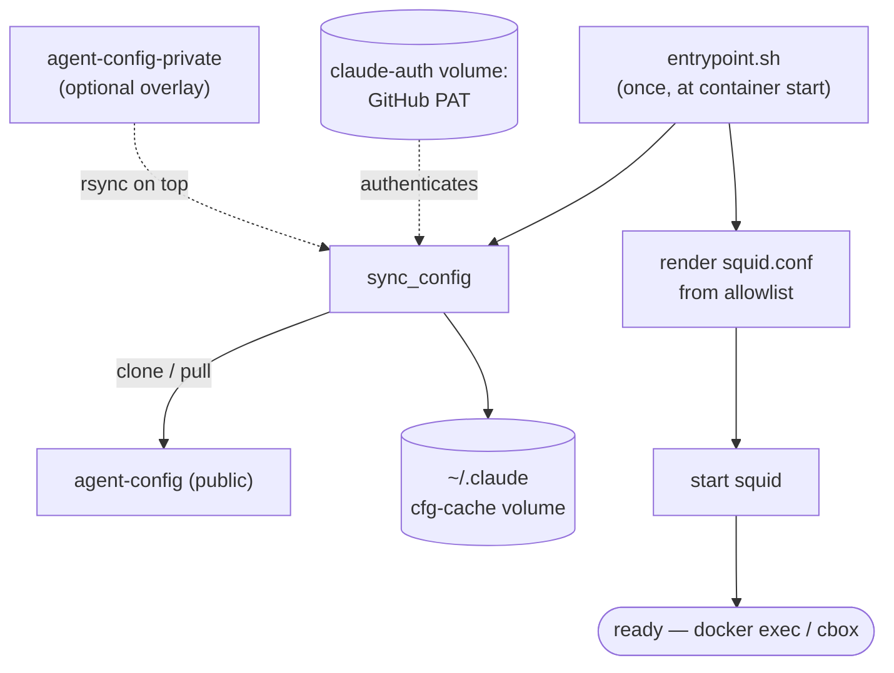

# agent-sandbox

A sandboxed Claude Code runtime: a Docker container that runs `claude` with hard guard
rails, automatic config, and a full audit trail.

- **Network egress** via a squid proxy (strict domain allowlist by default).
- **`gh` wrapper** that blocks destructive GitHub operations and logs every call.
- **`rm` / `rmdir` wrappers** and **pre-commit secret scanning**.
- **Automatic config** cloned from [agent-config](https://github.com/curtyo18/agent-config)
  at start, with an optional private overlay.
- **Full audit log** of commands and egress.

## Architecture at a glance


`bootstrap.sh` on the WSL2 host builds the image and runs one long-lived container; you work
inside it with `cbox`. Config is cloned from `agent-config` at startup, egress is HTTPS-only
through an allowlist, and a layer of guard rails (command wrappers, secret-scan, audit log)
wraps everything the agent does. The startup sequence is below; the *why* behind each choice
is in [docs/architecture.md](docs/architecture.md).

## Requirements

- Docker, on WSL2 (Ubuntu) — the blessed path. Plain Linux works too; see
  [Running without WSL](#running-without-wsl-what-bootstrap-automates).
- A GitHub Personal Access Token with `repo` scope (used to clone your config).

## Quick start (WSL2)

```bash
# 1. Clone into your projects directory (the defaults below assume ~/projects).
git clone https://github.com/curtyo18/agent-sandbox.git ~/projects/agent-sandbox
cd ~/projects/agent-sandbox

# 2. Store your GitHub PAT where bootstrap looks for it.
mkdir -p ~/.agent-sandbox
printf '%s' 'ghp_your_token_here' > ~/.agent-sandbox/github-pat
chmod 600 ~/.agent-sandbox/github-pat

# 3. Set your git identity, then build + run.
export GIT_USER_EMAIL="you@example.com"
export GIT_USER_NAME="Your Name"
bash bootstrap.sh

# 4. First time only: authenticate Claude.
docker exec -it claude-box bash -lc 'claude login'
```

Day-to-day:

```bash
cbox              # bash shell in /projects
cbox <repo>       # bash shell in /projects/<repo>
cbox -c           # claude in /projects
cbox -c <repo>    # claude in /projects/<repo>
```

If you cloned somewhere other than `~/projects/agent-sandbox`, set `REPO_DIR` and
`PROJECTS_HOST_PATH` to match (see [Configuration](#configuration)).

## How it boots

When `bootstrap.sh` starts the container, `entrypoint.sh` runs once: it authenticates with
your PAT, clones (or updates) `agent-config` into the persistent `~/.claude` volume —
rsyncing the optional private overlay on top — then renders `squid.conf` from your allowlist
and starts squid. After that it idles, ready for `cbox` / `docker exec`.



## Configuration

`bootstrap.sh` reads each setting as `VAR="${VAR:-default}"`, so anything you `export`
before running it overrides the default. (That's how the optional private overlay's
`launch.sh` drives bootstrap without editing the tracked file.)

| Variable | Required | Default | What it does |
|---|---|---|---|
| `GIT_USER_EMAIL` | **yes** | `you@example.com` | git commit identity inside the container |
| `GIT_USER_NAME` | **yes** | `Your Name` | git commit identity |
| `REPO_DIR` | no | `$HOME/projects/agent-sandbox` | where this repo lives on the host |
| `PROJECTS_HOST_PATH` | no | `$HOME/projects` | host dir bind-mounted as `/projects` |
| `AUDIT_HOST_PATH` | no | `$PROJECTS_HOST_PATH/.claude-audit` | host dir for the audit log |
| `CONTAINER_NAME` | no | `claude-box` | docker container name |
| `IMAGE_TAG` | no | `claude-box:latest` | docker image tag |
| `AGENT_SANDBOX_REPO` | no | _(placeholder URL)_ | repo cloned if `REPO_DIR` doesn't exist yet |
| `AGENT_CONFIG_REPO` | no | public `agent-config` | config base to clone — point at your own fork to use your config |
| `AGENT_CONFIG_PRIVATE_REPO` | no | _(empty)_ | **optional** private overlay (see below) |
| `CONTAINER_MODE` | no | `default` | set `research` for the research variant |
| `RESEARCH_REPO` | iff `research` | _(none)_ | repo cloned into `/projects/research` |
| `TZ` (build-arg) | no | `Europe/London` | container timezone; `docker build --build-arg TZ=…` |

Guard-rail override env vars (`CLAUDE_UNLOCK_DESTRUCTIVE`, `CLAUDE_ALLOW_SECRET_COMMIT`) are
documented in [docs/operations.md](docs/operations.md).

> The host-path defaults (`$HOME/...`) are placeholders. If your layout differs, export the
> vars above — or, like the maintainer, drive `bootstrap.sh` from a tiny private wrapper that
> exports them and then `exec`s this script.

## Private config overlay (optional)

**Entirely optional.** With nothing set, the container uses the public `agent-config` as-is.
To layer personal settings on top, point `AGENT_CONFIG_PRIVATE_REPO` at a private repo:

```bash
export AGENT_CONFIG_PRIVATE_REPO="https://github.com/you/agent-config-private.git"
bash bootstrap.sh
```

It's rsynced over the public config at start; private wins on any filename clash. If the
overlay clone fails, the container continues with public config only (non-fatal).

## Research mode

A variant with full internet access and write restrictions:

```bash
export CONTAINER_MODE=research
export RESEARCH_REPO="https://github.com/you/research.git"
bash bootstrap.sh
```

In research mode squid allows all HTTPS, `rm`/`rmdir` are blocked, `git push` is restricted
to `RESEARCH_REPO`, and any private overlay is disabled.

## Running without WSL (what bootstrap automates)

`bootstrap.sh` wraps the raw Docker flow with WSL conveniences (the `cbox` helper, a
clipboard bridge, host systemd tweaks). On a plain Linux host you can run the container
directly — but you must provision the PAT into the auth volume yourself, the step the old
quick-start was missing:

```bash
docker build -t claude-sandbox .          # TZ defaults to Europe/London; override with --build-arg TZ=…

docker run -d --name claude-sandbox \
  -e GIT_USER_EMAIL="you@example.com" \
  -e GIT_USER_NAME="Your Name" \
  -v claude-auth:/home/claude/.claude-auth \
  -v "$HOME/projects:/projects" \
  claude-sandbox

# Provision the PAT, then restart so the entrypoint picks it up and clones config.
docker cp ~/.agent-sandbox/github-pat claude-sandbox:/home/claude/.claude-auth/github-pat
docker exec claude-sandbox chown claude:claude /home/claude/.claude-auth/github-pat
docker exec claude-sandbox chmod 600 /home/claude/.claude-auth/github-pat
docker restart claude-sandbox

docker exec -it claude-sandbox bash -lc 'claude login'
docker exec -it claude-sandbox bash -lc 'cd /projects && claude --dangerously-skip-permissions'
```

Without the PAT the container still starts, but config-clone is skipped (no skills/hooks).

## Network allowlist


Default strict allowlist: anthropic.com, claude.ai, github.com, npmjs.org, pypi.org,
Cloudflare API. Edit `network-allowlist.conf` in your agent-config and restart the
container. See [docs/operations.md](docs/operations.md) for adding hosts globally or
per-project.

## Phone access (optional)

`scripts/session-launcher.py` runs inside the container (on `:8088`) and lets you
spawn/restart Claude sessions from a phone once it's fronted by Tailscale. Tailscale
fronting is off by default. See [docs/operations.md](docs/operations.md) and
[docs/architecture.md](docs/architecture.md).

## Docs

- [docs/operations.md](docs/operations.md) — day-2 reference (daily entry, recovery, overrides, audit).
- [docs/architecture.md](docs/architecture.md) — the *why* behind the design.
- [docs/verification.md](docs/verification.md) — verifying the guard rails.

## Roadmap

See [ROADMAP.md](ROADMAP.md) for planned improvements: project scoping, scoped PATs, and
mobile terminal access.
