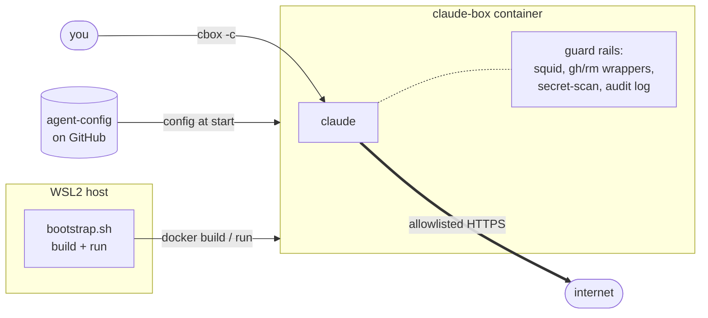
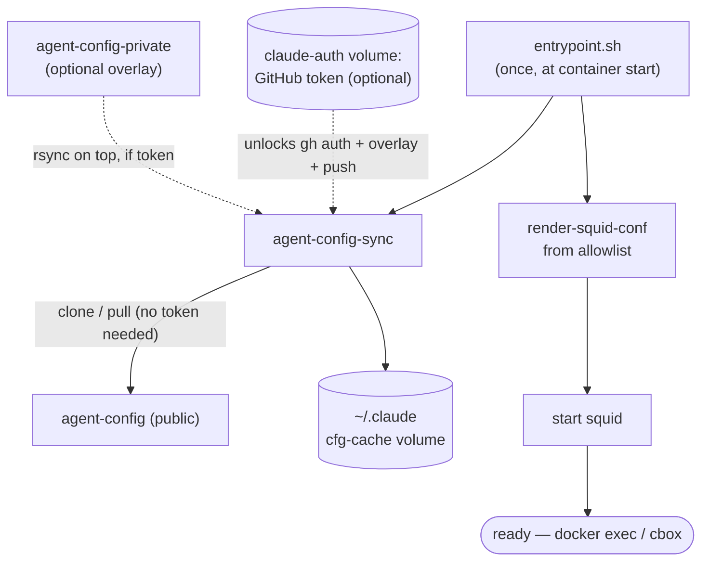
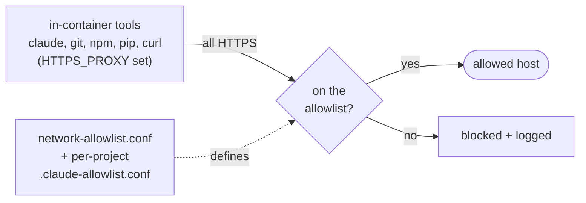

# agent-sandbox

A sandboxed Claude Code runtime: a Docker container that runs `claude` with hard guard
rails, automatic config, and a full audit trail.

- **Network egress** via a squid proxy (strict domain allowlist by default).
- **`gh` wrapper** that blocks destructive GitHub operations and logs every call.
- **`rm` / `rmdir` wrappers** and **pre-commit secret scanning**.
- **Automatic config** cloned from [agent-config](https://github.com/curtyo18/agent-config)
  at start, with an optional private overlay.
- **Full audit log** of commands and egress.

## Architecture at a glance



`bootstrap.sh` on the WSL2 host builds the image and runs one long-lived container; you work
inside it with `cbox`. Config is cloned from `agent-config` at startup, egress is HTTPS-only
through an allowlist, and a layer of guard rails (command wrappers, secret-scan, audit log)
wraps everything the agent does. It's GitHub-first but not GitHub-only — any HTTPS git host
(GitLab, Bitbucket, Gitea, self-hosted) works for clone/commit/push; see [Using other git
hosts](#using-other-git-hosts). The startup sequence is below; the *why* behind each choice
is in [docs/architecture.md](docs/architecture.md).

## Requirements

- Docker, on WSL2 (Ubuntu) — the blessed path. Plain Linux works too; see
  [Running without WSL](#running-without-wsl-what-bootstrap-automates).
- Git host access — **optional and host-agnostic**. Any HTTPS host works (GitHub, GitLab,
  Bitbucket, Gitea, self-hosted); without credentials the container still comes up as a working
  tokenless session. GitHub uses `gh` or a `repo`-scope PAT; other hosts use a per-host credential.
  See [GitHub access](#github-access) and [Using other git hosts](#using-other-git-hosts).

## Quick start (WSL2)

`bash bootstrap.sh --init` is the guided path: it walks you through GitHub access (a detected `gh`
login / a PAT file / skip for a tokenless session) **and credentials for any other git host**
(GitLab, Bitbucket, Gitea, self-hosted), confirms your git identity and projects directory, then
writes `~/.agent-sandbox/.env` and builds — recording where you cloned, so there's nothing to set
by hand.

```bash
# 1. Clone anywhere — --init records the path for you.
git clone https://github.com/curtyo18/agent-sandbox.git ~/projects/agent-sandbox
cd ~/projects/agent-sandbox

# 2. (Optional) git host access. For GitHub: `gh auth login` to act as yourself (or let --init
#    use a PAT file). --init also prompts for other hosts (GitLab/Bitbucket/Gitea/self-hosted) —
#    or skip it all for a tokenless session. See "GitHub access" / "Using other git hosts".
gh auth login

# 3. Guided setup + build. Answer the prompts; it writes ~/.agent-sandbox/.env, then runs.
bash bootstrap.sh --init

# 4. First run only: sign in to Claude itself — the Anthropic login, separate from GitHub.
docker exec -it claude-box bash -lc 'claude login'
```

Day-to-day:

```bash
cbox              # bash shell in /projects
cbox <repo>       # bash shell in /projects/<repo>
cbox -c           # claude in /projects
cbox -c <repo>    # claude in /projects/<repo>
cbox-refresh-pat  # add/refresh the GitHub token on the running container (no restart)
```

**Prefer to configure by hand?** Skip `--init` and run `bash bootstrap.sh` directly: git
identity is auto-detected from your host `git config` / `gh` account (export `GIT_USER_EMAIL` /
`GIT_USER_NAME` to override), and everything else comes from `~/.agent-sandbox/.env` or exported
env vars (see [Configuration](#configuration)). If you cloned outside `~/projects/agent-sandbox`,
set `REPO_DIR` and `PROJECTS_HOST_PATH` to match.

## GitHub access

The container does all its GitHub work — cloning your config, `git push`, `gh pr create` —
through **one token, and that token decides which GitHub identity the agent acts as.** At
startup `entrypoint.sh` runs `gh auth setup-git`, so it's the credential for *every* git /
`gh` operation inside the container, not just the initial config clone. Bootstrap reads it
from `~/.agent-sandbox/github-pat`.

**Pick the identity, then hand bootstrap the token:**

1. **Easiest — act as you.** Reuse your host `gh` login; bootstrap auto-fills the token via
   `gh auth token`, nothing to create or rotate. Commits and PRs land under your account:
   ```bash
   gh auth login        # once, if you haven't already
   bash bootstrap.sh    # auto-uses the host token when no PAT file exists
   ```
2. **Cleaner — a dedicated agent identity.** Mint a PAT for a separate bot/agent account (or
   `gh auth login` as it), and drop it in explicitly. The agent's commits are attributable to
   *it*, not you, and you can scope the token tighter — worth it if you want that separation:
   ```bash
   mkdir -p ~/.agent-sandbox
   printf '%s' 'ghp_your_token_here' > ~/.agent-sandbox/github-pat
   chmod 600 ~/.agent-sandbox/github-pat
   ```

**Scope:** a classic PAT with `repo` scope covers private clones, push, and PRs. (Fine-grained
PATs need at least *Contents: read/write* and *Pull requests: read/write* on the repos you'll
touch.) The `gh` wrapper blocks destructive operations regardless of scope.

**Without a token** the container is still a fully working session — public config, skills,
hooks, git identity, the `claude()` wrapper, and network egress all come up. Only the
token-gated extras are off: private clones, `git push`, `gh pr create`, and the private overlay.
Add a token whenever you like, **without a rebuild or restart**:

```bash
cbox-refresh-pat            # reuse your host `gh auth token`
cbox-refresh-pat <path>     # a PAT file (repo scope)
```

(If you point `AGENT_CONFIG_REPO` at a *private* fork, that clone does need a token — the
tokenless guarantee is for the public default. And because the container's env is fixed at
`docker run`, *adding* a private overlay later needs a restart with `AGENT_CONFIG_PRIVATE_REPO`
set; a token refresh covers auth and push for the repos already configured.) The token lives on
the persistent `claude-auth` volume (chmod 600), never baked into the image.

## Using other git hosts

GitHub works out of the box; GitLab, Bitbucket, Gitea, and self-hosted instances work too — the
container's git operations aren't GitHub-specific. To use another host:

1. **Allowlist it.** `github.com`, `gitlab.com`, and `bitbucket.org` are reachable by default. For
   anything else (Codeberg, self-hosted), add it to `network-allowlist.conf` in your agent-config,
   e.g. `acl allowed_hosts dstdomain .your-host.com`, then restart.
2. **Add a credential.** Put one line per host in `~/.agent-sandbox/git-credentials` (chmod 600);
   bootstrap provisions it and the container serves it via git's credential store — this runs
   alongside your GitHub `gh` login (separate helpers), so it never disturbs GitHub access.
   (`bootstrap.sh --init` provisions these interactively, or via `AGENT_GIT_CREDENTIALS` in CI;
   you can also edit this file by hand.) The username prefix differs by provider:

   | Host | `~/.agent-sandbox/git-credentials` line | Open a PR/MR |
   |---|---|---|
   | GitHub | *(uses your `gh` login — nothing to add)* | `gh pr create` |
   | GitLab | `https://oauth2:<token>@gitlab.com` | push prints an MR URL |
   | Bitbucket | `https://<user>:<app-password>@bitbucket.org` | push prints a PR URL |
   | Gitea / self-hosted | `https://<token>@your.host` | push prints a PR URL |

3. **Work as usual.** `git clone/commit/push/branch` against that host now work. Opening a PR/MR is
   done via the URL the host prints on push — provider CLIs like `glab` aren't installed, which is
   also the safety boundary: with no provider CLI, a non-GitHub host is reachable only through
   `git`, which can't delete a repo or change its visibility.

**SSH instead?** An SSH remote (`git@host:you/repo.git`) plus a mounted deploy key is a zero-token
option, but port 22 egress is **not** filtered by the squid allowlist — it widens the egress
surface. HTTPS + `git-credentials` keeps everything inside the proxy and is the default.

## How it boots

When `bootstrap.sh` starts the container, `entrypoint.sh` runs once: it calls `agent-config-sync`,
which clones (or updates) the *public* `agent-config` into the persistent `~/.claude` volume,
wires git identity + the `claude()` wrapper, and seeds workspace trust — all with **no token
needed**. A GitHub token only adds `gh` auth, the private overlay, and authenticated push. It
then renders `squid.conf` from the allowlist and starts squid, and idles, ready for `cbox` /
`docker exec`.



## Configuration

`bootstrap.sh` reads each setting as `VAR="${VAR:-default}"`, so anything you `export`
before running it overrides the default — handy for a personal wrapper script that exports
your values and then runs bootstrap without editing the tracked file.

You can also put any of these in `~/.agent-sandbox/.env` (copy `dotenv.example`, or run
`bootstrap.sh --init`) instead of exporting them each time. Precedence is **exported env >
`.env` > the defaults below**, so a wrapper that exports vars always wins over the file. Run
`bootstrap.sh --print-config` (alias `--dry-run`) to see the resolved values without building;
add `--non-interactive` to `--init` to script first-run setup in CI (it reads the same vars from
the environment instead of prompting).

| Variable | Required | Default | What it does |
|---|---|---|---|
| `GIT_USER_EMAIL` | auto | host `git config`, else gh account | git commit identity; export to override |
| `GIT_USER_NAME` | auto | host `git config`, else gh account | git commit identity; export to override |
| `REPO_DIR` | no | `$HOME/projects/agent-sandbox` | where this repo lives on the host |
| `PROJECTS_HOST_PATH` | no | `$HOME/projects` | host dir bind-mounted as `/projects` |
| `AUDIT_HOST_PATH` | no | `$PROJECTS_HOST_PATH/.claude-audit` | host dir for the audit log |
| `CONTAINER_NAME` | no | `claude-box` | docker container name |
| `IMAGE_TAG` | no | `claude-box:latest` | docker image tag |
| `AGENT_SANDBOX_REPO` | no | _(placeholder URL)_ | repo cloned if `REPO_DIR` doesn't exist yet |
| `AGENT_CONFIG_REPO` | no | public `agent-config` | config base to clone — point at your own fork to use your config |
| `AGENT_CONFIG_PRIVATE_REPO` | no | _(empty)_ | **optional** private overlay (see below) |
| `CONTAINER_MODE` | no | `default` | set `research` for the research variant |
| `RESEARCH_REPO` | iff `research` | _(none)_ | repo cloned into `/projects/research` |
| `TZ` (build-arg) | no | `Europe/London` | container timezone; `docker build --build-arg TZ=…` |

Guard-rail override env vars (`CLAUDE_UNLOCK_DESTRUCTIVE`, `CLAUDE_ALLOW_SECRET_COMMIT`) are
documented in [docs/operations.md](docs/operations.md).

> The host-path defaults (`$HOME/...`) are placeholders. If your layout differs, put your values
> in `~/.agent-sandbox/.env` — or `export` them, or drive `bootstrap.sh` from a small private
> wrapper that exports them and then `exec`s this script.

## Private config overlay (optional)

**Entirely optional.** With nothing set, the container uses the public `agent-config` as-is.
To layer personal settings on top, point `AGENT_CONFIG_PRIVATE_REPO` at a private repo:

```bash
export AGENT_CONFIG_PRIVATE_REPO="https://github.com/you/agent-config-private.git"
bash bootstrap.sh
```

It's rsynced over the public config at start; private wins on any filename clash. If the
overlay clone fails, the container continues with public config only (non-fatal).

## Research mode

A variant with full internet access and write restrictions:

```bash
export CONTAINER_MODE=research
export RESEARCH_REPO="https://github.com/you/research.git"
bash bootstrap.sh
```

In research mode squid allows all HTTPS, `rm`/`rmdir` are blocked, `git push` is restricted
to `RESEARCH_REPO`, and any private overlay is disabled.

## Running without WSL (what bootstrap automates)

`bootstrap.sh` wraps the raw Docker flow with WSL conveniences (the `cbox` helper, a
clipboard bridge, host systemd tweaks). On a plain Linux host you can run the container
directly — you provision the token into the auth volume yourself and pass real
`GIT_USER_*` (there's no identity auto-detection on this path):

```bash
docker build -t claude-sandbox .          # TZ defaults to Europe/London; override with --build-arg TZ=…

docker run -d --name claude-sandbox \
  -e GIT_USER_EMAIL="you@example.com" \
  -e GIT_USER_NAME="Your Name" \
  -v claude-auth:/home/claude/.claude-auth \
  -v "$HOME/projects:/projects" \
  claude-sandbox

# Provision the PAT, then restart so the entrypoint picks it up and clones config.
docker cp ~/.agent-sandbox/github-pat claude-sandbox:/home/claude/.claude-auth/github-pat
docker exec claude-sandbox chown claude:claude /home/claude/.claude-auth/github-pat
docker exec claude-sandbox chmod 600 /home/claude/.claude-auth/github-pat
docker restart claude-sandbox

docker exec -it claude-sandbox bash -lc 'claude login'
docker exec -it claude-sandbox bash -lc 'cd /projects && claude --dangerously-skip-permissions'
```

Without a token the container still comes up as a working tokenless session (public config,
identity, wrapper, egress); only private clone/push and the overlay wait for a token (add one
later with `cbox-refresh-pat`).

## Network allowlist



Two sources feed the allowlist. **The curated git hosts — `github.com`, `gitlab.com`, and
`bitbucket.org` — are always allowed**, baked into `render-squid-conf` so they survive even if
the config clone fails. Everything else comes from `network-allowlist.conf` in your agent-config
(by default: Anthropic/Claude, npm, PyPI, GitHub raw + ghcr, Cloudflare, and a few more). To add
a host, edit `network-allowlist.conf` in your agent-config and restart the container. See
[docs/operations.md](docs/operations.md) for adding hosts globally or per-project.

## Phone access (optional)

`scripts/session-launcher.py` runs inside the container (on `:8088`) and lets you
spawn/restart Claude sessions from a phone once it's fronted by Tailscale. Tailscale
fronting is off by default. See [docs/operations.md](docs/operations.md) and
[docs/architecture.md](docs/architecture.md).

## Docs

- [docs/operations.md](docs/operations.md) — day-2 reference (daily entry, recovery, overrides, audit).
- [docs/architecture.md](docs/architecture.md) — the *why* behind the design.
- [docs/verification.md](docs/verification.md) — verifying the guard rails.

## Roadmap

See [ROADMAP.md](ROADMAP.md) for planned improvements: project scoping, scoped PATs, and
mobile terminal access.
